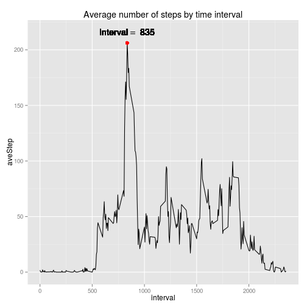
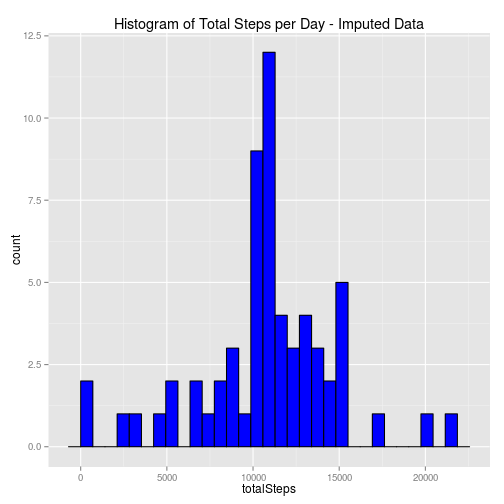
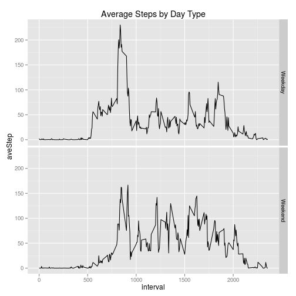

### Brad Kenny - 17 June 2014

The following is a quick demonstration of statistically literate programming.  
Where reproducible code is included in the human readable document to allow for 
easily reproduced results.

Our data are taken from a personal activity monitoring device - with step numbers collected during five minute intervals over the course of October and November 2012.


### Data Preprocessing

First we will load non standard packages that will be useful through the course of the analysis:


```r
library(ggplot2)
library(plyr)
```

And now will read in our data file - transforming the date into a useful R Date object.  Remember to set your working directory here!:


```r
setwd("/home/brad/Documents/Classes/Coursera/RepResearch/RepData_PeerAssessment1/")

myClasses = c("integer","Date","integer")
moveDat = read.csv(unz("activity.zip","activity.csv"),colClasses = myClasses)

moveDat$date = as.Date(moveDat$date,format = "%Y-%m-%d")
head(moveDat)
```

```
##   steps       date interval
## 1    NA 2012-10-01        0
## 2    NA 2012-10-01        5
## 3    NA 2012-10-01       10
## 4    NA 2012-10-01       15
## 5    NA 2012-10-01       20
## 6    NA 2012-10-01       25
```
We will be answering a few questions about the data posed by Dr. Roger Peng.

### What is mean total number of steps taken per day?

Ignoring any missing values in the dataset, we will make a histogram of the total number of steps taken per day.  First, we pivot our original dataset on the date, and sum the steps taken - and then look at the histogram.


```r
totStep = ddply(.data = moveDat,.(date), summarize,totalSteps = sum(steps,na.rm=T))

ggplot(aes(x = totalSteps),data = totStep) + geom_histogram(fill = "blue",color="black") +
    ggtitle("Histogram of Total Steps per Day")
```

 

The distribution appears to be a bit left skew, with a lot of values in our first bin - perhaps a consequence of removing our NA values. 

The mean and median of the total steps taken per day are

```r
print(paste("Mean: ",mean(totStep$totalSteps)))
```

```
## [1] "Mean:  9354.22950819672"
```

```r
print(paste("Median: ",median(totStep$totalSteps)))
```

```
## [1] "Median:  10395"
```

### What is the average daily activity pattern?

Here we will look at a time series plot of the average number of steps taken during the five minute intervals, averaged over all of the days.  Again, we will ignore missing values although a full investigation of whether it is reasonable to assume that the data are missing completely at random (MCAR) has not been undertaken.


```r
totStep.interval = ddply(moveDat,.(interval),summarize,aveStep=mean(steps,na.rm=T),
                         totStep = sum(steps,na.rm=T))
maxInterval = totStep.interval$interval[totStep.interval$aveStep == 
                                            max(totStep.interval$aveStep)]
myLab = paste("Interval = ",maxInterval)
ggplot(aes(x=interval,y=aveStep),data=totStep.interval) + geom_line() +
    geom_point(aes(x=maxInterval,y=aveStep[interval==maxInterval]),color = "red",size=3) +
    ggtitle("Average number of steps by time interval") + 
    geom_text(aes(x=maxInterval,y=aveStep[interval==maxInterval]+10,label = myLab ))
```

 

We see the maximum average number of steps to be at time interval 835 - which, if we consider time interval 0 to be 2400/0000/12:00 AM does make sense as many people may conduct exercise in the mornings (0835) with various walking throughout the day until starting to settle down at about 2000/8:00 PM.

### Missing value imputation

Now we will impute our missing values.  The method used was: if a value was missing for a given interval, replace it with the mean value of that interval averaged over all days.  More sophisticated methods exist (such as taking into account averages for a given day of week, regression imputation, etc), but this method should fit our needs.


```r
moveDat.impute = moveDat

# For loops are comforting... Replaces NA values with the averages computed
#during the last question
for(i in 1:length(moveDat.impute$steps)){
    moveDat.impute$steps[i] = if(is.na(moveDat.impute$steps[i])){
                                totStep.interval$aveStep[totStep.interval$interval 
                                                         == moveDat.impute$interval[i]]
                            }else{moveDat.impute$steps[i]}
}

head(moveDat.impute)
```

```
##     steps       date interval
## 1 1.71698 2012-10-01        0
## 2 0.33962 2012-10-01        5
## 3 0.13208 2012-10-01       10
## 4 0.15094 2012-10-01       15
## 5 0.07547 2012-10-01       20
## 6 2.09434 2012-10-01       25
```

Comparing the head above with the original data head output, we see that our missing
values are now imputed.

The total number of missing values that we had to impute can be given by using 
a logical vector and looking at the TRUE values of it:


```r
naVec = is.na(moveDat$steps)
table(naVec,useNA = "ifany")["TRUE"]
```

```
## TRUE 
## 2304
```

We will now repeat what we did at the top of the document with a histogram, and 
reporting the mean and median.


```r
totStep.impute = ddply(.data = moveDat.impute,.(date), summarize,totalSteps = sum(steps))

ggplot(aes(x = totalSteps),data = totStep.impute) + geom_histogram(fill = "blue",color="black") +
    ggtitle("Histogram of Total Steps per Day - Imputed Data")
```

```
## stat_bin: binwidth defaulted to range/30. Use 'binwidth = x' to adjust this.
```

 

```r
print(paste("Mean: ",mean(totStep.impute$totalSteps)))
```

```
## [1] "Mean:  10766.1886792453"
```

```r
print(paste("Median: ",median(totStep.impute$totalSteps)))
```

```
## [1] "Median:  10766.1886792453"
```

Overall, the shape of the histogram does not seem to have changed overall much,
although we lost several values in our first bin.  Interestingly, the mean and 
median are the same value.  Imputation shifted values in the histogram 
towards the middle bins.

### Are there differences in activity patterns between weekdays and weekends?

We add a new variable to our imputed dataset (day) to let us examine whether a 
given date is on a Saturday or Sunday ("Weekend"), or during the typical Western
work week.


```r
for(i in 1:length(moveDat.impute$date)){
    moveDat.impute$day[i] = if(weekdays(moveDat.impute$date[i]) %in% c("Saturday","Sunday")){
        "Weekend"
    }else{"Weekday"}
}

head(moveDat.impute)
```

```
##     steps       date interval     day
## 1 1.71698 2012-10-01        0 Weekday
## 2 0.33962 2012-10-01        5 Weekday
## 3 0.13208 2012-10-01       10 Weekday
## 4 0.15094 2012-10-01       15 Weekday
## 5 0.07547 2012-10-01       20 Weekday
## 6 2.09434 2012-10-01       25 Weekday
```

We will now recreate our time series plot from earlier, but this time separating 
out whether the day is a weekday, or a weekend.

First, we will pivot on both the interval, and the day type - and then plot.


```r
totStep.impute.interval = ddply(moveDat.impute,.(interval,day),summarize,aveStep=mean(steps,na.rm=T),
                         totStep = sum(steps,na.rm=T))
ggplot(aes(x = interval,y = aveStep),data = totStep.impute.interval) +
    geom_line() + facet_grid(day ~ .) +ggtitle("Average Steps by Day Type")
```

 

We see much less of a peek in the 0800 to 0900 hour, as well as a lower slope 
during the early mornings - perhaps indicating that the people in the study were
more "relaxed" on the weekends, not needing to wake up at a certain time.  We also 
see that the average number of steps throughout the day are increased over weekdays,
 perhaps indicative that the subjects work at desk type jobs during the week.  
 
 It is also interesting to note that average number of steps tail off later on the
 weekend.  It may be interesting to look at this evening behavior over Friday and Saturday, 
 as opposed to Saturday and Sunday. 
